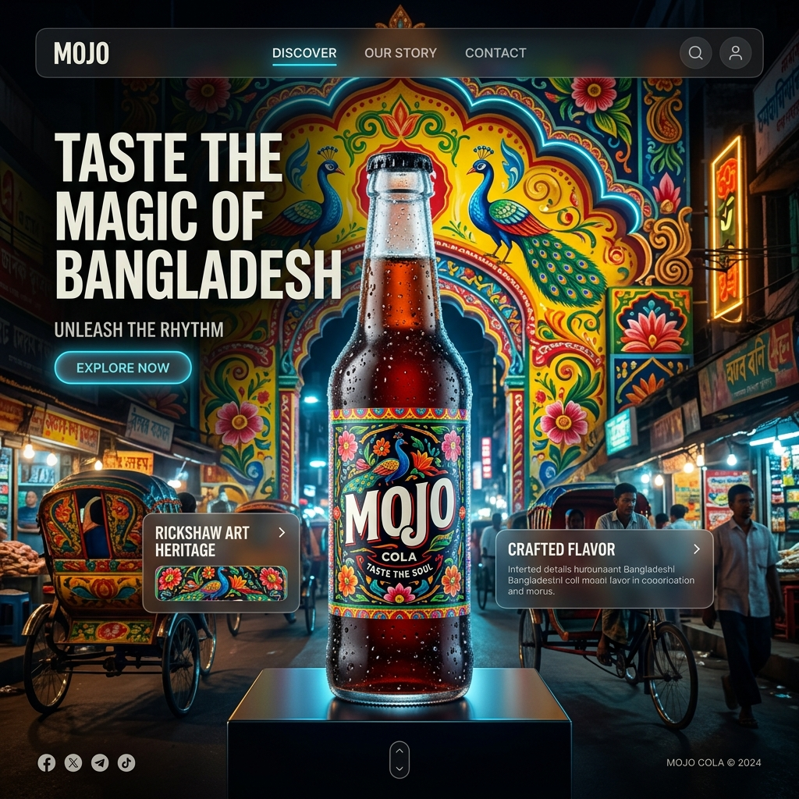

# 🥤 MOJO - High-Voltage 3D Rickshaw Art Experience

MOJO is a premium, high-performance 3D landing page celebrating Bangladesh's iconic cola brand. It fuses immersive 3D graphics with the vibrant soul of Rickshaw Art, featuring smooth scroll-driven animations and a powerful narrative of local pride and global solidarity.



## ✨ Features

- **Immersive 3D Experience**: High-fidelity 3D rendering of the iconic MOJO bottle and environment.
- **Cultural Fusion**: Integrated Rickshaw Art aesthetics, celebrating Bangladeshi heritage.
- **Cinematic Animations**: Ultra-smooth, scroll-triggered storytelling powered by GSAP.
- **Global Solidarity**: Dedicated section for Palestine support, reflecting the brand's values.
- **Premium UI/UX**: Sleek dark-mode design with glassmorphic elements and high-end typography.
- **Responsive Mastery**: Fully optimized for a seamless experience across all devices.
- **Advanced Post-Processing**: Bloom, Vignette, and Tone Mapping for a cinematic visual feel.

## 🛠️ Tech Stack

- **Framework**: [React 19](https://react.dev/) for a cutting-edge component architecture.
- **3D Engine**: [Three.js](https://threejs.org/) via [React Three Fiber](https://docs.pmnd.rs/react-three-fiber).
- **Animation**: [GSAP](https://greensock.com/gsap/) for industry-standard scroll-driven motion.
- **Utility**: [React Three Drei](https://docs.pmnd.rs/drei) for advanced 3D helpers.
- **Visual Effects**: [@react-three/postprocessing](https://github.com/pmndrs/react-postprocessing) for cinematic bloom and depth.
- **Styling**: Vanilla CSS with modern variables for maximum performance and control.

## 🎨 Project Philosophy

This project is more than just a landing page; it's a digital tribute to **Bangladeshi Heritage**. By blending the traditional "Rickshaw Art" aesthetic with high-end 3D rendering, we aim to showcase how local culture can be reimagined in a modern, global context. It also stands as a symbol of **Solidarity**, highlighting the brand's commitment to social justice.

## 🚀 Getting Started

### Prerequisites

- Node.js (Latest LTS recommended)
- npm or yarn

### Installation

1. Clone the repository:

   ```bash
   git clone https://github.com/sahedalomsumit/lemillion.git
   ```

2. Install dependencies:

   ```bash
   npm install
   ```

3. Start the development server:

   ```bash
   npm run dev
   ```

4. Build for production:
   ```bash
   npm run build
   ```

## 📜 License

This project is for demonstration and portfolio purposes. **MOJO** is a trademark of Akij Food & Beverage Ltd. This site is a fan-made tribute and is not officially affiliated with the brand.

---

Built with ⚡ and ❤️ by [Sumit](https://github.com/sahedalomsumit)
